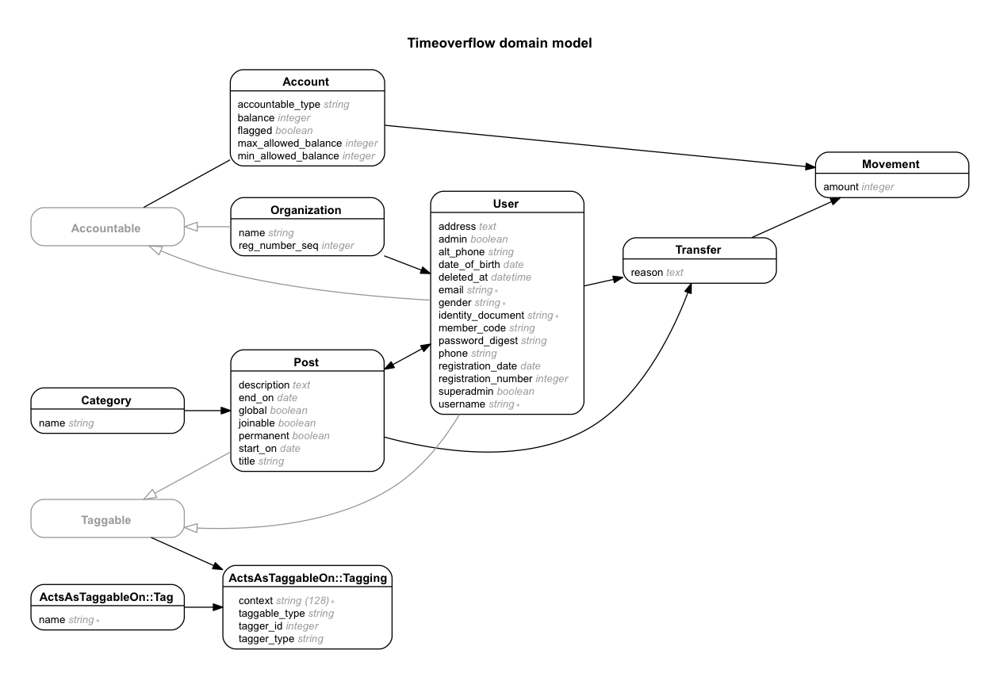

TimeOverflow
============

>Entity-relation diagram written using

```bash
    bundle exec rake erd filetype=png inheritance=false polymorphism=true indirect=false
```


````

#### 16 Dec 2015 Oleg G.Kapranov

